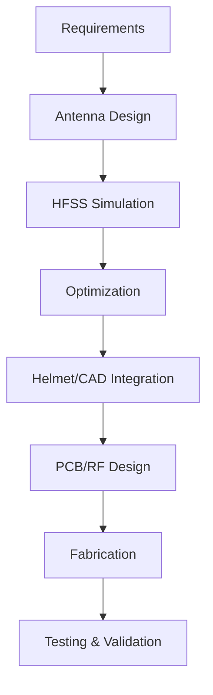

# Helmet-Mounted Conformal Antenna for Tactical Communications

## Team UniComm
SIH Problem Statement ID : 26185 

SIH Problem Statement Title : Helmet mounted conformal antenna for tactical communications in urban CQB environments.

## About the Project
Our team has designed an advanced combat helmet and a 4-element array high bandwidth conformal microstrip antenna which can help combat the challenges of carrying heavy antennas in challenging terrains . 

Having the antenna attached on the highest point of the body has many advantages in modern warfare as it is more rigid, stable and the combat system is away from many interferers . 

The project combines antenna theory, electromagnetic simulation, mechanical CAD, PCB/RF design, fabrication, and experimental validation to develop and evaluate the final antenna.
## Problem
The biggest issue with the existing antennas is that they are attached on vests (lower part of the body) due to which it has high potential for interference due to other gear hanging off the soldier .

Apart from this there are many health issue associated with RF radiation absorbed by human tissue which are faced by soldiers . 

A cumbersome and inflexible antenna connection to the radio the radio is normally carried on the torso of the solider which significantly reduces their mobility . 

## Proposed Solution
Our Helmet and Antenna system is composed of an array of 4 conformal microstrip antennas which are integrated into the helmet CAD model . 

Its geometry and placement are modified in a such a way so that the SAR(Specific Absorption Rate) is reduced , to reduce health issues due to absorption of RF radiation . 

We have also ensured that the antenna has broad bandwidth of approximately 1950MHz so that it is functional even in difficult terrains . 

## Project Workflow

## Components & Materials
- Conformal antenna
- Conductive layer
- Dielectric substrate
- Ground plane
- RF connector/feed
- Helmet structure
- Mounting/integration components

## Software & Tools
- ANSYS Electronics Desktop – HFSS — Electromagnetic simulation and antenna optimization

- Autodesk Fusion — 3D CAD modelling and mechanical integration

- KiCad — PCB, RF feed and electronic design

## Screenshots 

## Demo Video 
Video Link - [Demo](https://drive.google.com/drive/folders/1khO5Z29cvm5YgOVR-S61beP-3Wg1a1dk)

## Presentation 
PPT Link - [PPT](https://drive.google.com/drive/folders/1fTRBkRC-g62Nol-qG1CEuhmRR5Y_4V7y)

## Project Files
📐 CAD Files — [Google Drive link](https://drive.google.com/drive/folders/1Ghx63GEvrWdhvsjdL0f3LoNjhmAbbQZF?usp=sharing)
📡 Antenna Design — [Google Drive link](https://drive.google.com/drive/folders/1qPXDP5t2O03s7yiJq4HqOWixTVWuIKwu?usp=sharing)
🔌 KiCad Files — [Google Drive link](https://drive.google.com/drive/folders/1HaP6uq5_J6CeXrYCBEnNkqeeh7BnDaaF?usp=sharing)

## Future Scope 
We aim to refine the design of the antenna to yield even better results and work on the circuitry to power the system .
Furthermore we will get the helmet design 3D printed and prepare the final prototype of the same and connect the antenna to IPEX to SAM adapter to make it fully functional . 

## Team
Team UniComm
NSUT | SIH 2026
